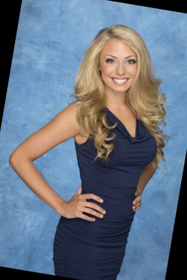
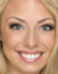
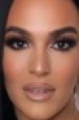
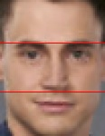
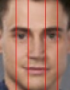
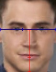
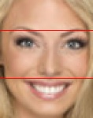
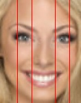
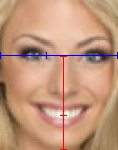

# The Bachelor/Bachelorette Contestant Feature Analysis


DSCI-510 Final Project

Compare the features and place (the number of episodes the contestant was on the show for) of past contestants of ABC's The Bachelor and The Bachelorette.

## TLDR

Build the docker container:
```
docker build . --tag bach
```

Add your Instagram credentials to data/ig.cfg, then collect all data sets from remote sources:
```
docker run --volume $(pwd):/home/ bach collect.py
```

Transform/preprocess data for data set 5 and perform evaluations with all algorithms:
```
docker run --volume $(pwd):/home/ bach transform.py
```

Review analysis with Jupyter:
```
jupyter notebook analysis/bachanalysis.ipynb
```

## Data sets:

1. General data about the shows
   1. Data about The Bachelor
   2. Data about The Bachelorette shows
2. General data about the shows' seasons
   1. Data about The Bachelor seasons
   2. Data about The Bachelorette seasons
3. Data about The Bachelor and The Bachelorette contestants
4. Instagram data from contestants
5. Granular contestant data compiled from "transformed" data from the other data sets, including measured physical features and quantified "overall attractiveness" from known algorithms: rule of thirds, rule of fifths, and the golden ratio.

## Data Models and Data Storage

Data is stored in pickled pandas dataframes saved in the ./data/ directory. The structure of these dataframes, as defined by the data model, is as follows:

```
>> df1.columns
["season", "original_run", "suitor", "winner", "runnersup", "proposal", "show", "still_together", "relationship_notes"]
>> df2.columns
["id", "name", "age", "hometown", "occupation", "eliminated", "season", "show", "profile_url", "place"]
>> df3.columns
["id", "name", "photo", "profile_url", "born", "hometown", "occupation", "seasons", "social_media", "height"]
>> df4.columns
["id", "followers", "following", "is_private", "name", "photo1", "photo1_comments", "photo1_likes", "photo1_comments_disabled", "photo1_timestamp", "photo2", "photo2_comments", "photo2_likes", "photo2_comments_disabled", "photo2_timestamp", "photo3", "photo3_comments", "photo3_likes", "photo3_comments_disabled", "photo3_timestamp", "post_count", "prof_photo", "url", "user_id", "username"]
>> df5.columns
["id", "name", "dlib_landmarks", "face_photo", "face_height", "face_width", "theoretical_thirds", "experimental_thirds1", "experimental_thirds2", "experimental_thirds3", "theoretical_fifths", "experimental_fifths1", "experimental_fifths2", "experimental_fifths3", "experimental_fifths4", "experimental_fifths5", "hw_ratio", "v1_ratio", "v2_ratio", "v3_ratio", "v4_ratio", "v5_ratio", "v6_ratio", "v7_ratio", "h1_ratio", "h2_ratio", "h3_ratio", "h4_ratio", "h5_ratio", "h6_ratio", "h7_ratio"]
```

### Model Class

The data is modeled as above in JSON format.

#### Methods

save_df(df, ds): Pickle and save the given dataframe as a data set.

retrieve_df(ds): Retrieve a given data set as a dataframe.

set_place(data): Take-in a list of raw scraped json objects, each associated with a contestant, from data source 2 and evaluate each contestant's place.

model_one(ds, data): Take-in an integer data set number and a single raw json (dict) object and return a single json (dict) object modeled for the specified data set

model_many(ds, datas): Take-in an integer data set number and a list of raw json (dict) objects and return a list of json (dict) objects all modeled for the specific data set

## Collection

Collect data sets, facilitate the modeling of raw data, and facilitate the insertion of modeled data into data storage (SQL database).

### How to Run

Build the docker container:
```
docker build collection/ --tag bach
```

#### Arguments:

* set: Optional. Default: [1,2,3,4]. An integer associated with the desired data set to be collected. This can be a list of integers.
* season: Optional. Default: all seasons (via data sets 1.1 and 1.2). An integer or list of integers associated with a desired season to collect data on. Only applicable with data set 2.
* contestant: Optional. Default: all contestants (via data sets 2.1 and 2.2). A case insensitive string or list of case insensitive strings associated with the first and last name separated by a "_" of a contestant from any season of The Bachelor or Bachelorette or the URL of a contestant's profile page on the [Bachelor Nation Fandom Wiki](https://bachelor-nation.fandom.com). Only applicable with data set 3.

#### Instagram (Undocumented) API

To collect data from the undocumented Instagram API for data set 4, Instagram credentials are required. The Instagram API scraper class used by collect.py uses the configparser package to read-in and parse a config file named ig.cfg located in data/. Simply edit the file and save. For example:
```
[Instagram]
username = ilovethebachelor
password = w!lly0uacc3ptth!sr0s3
```
(These are totally not my creds 😬🤥)

#### Examples:

Collect all available data for all data sets from remote sources (overwrite ds1.pkl, ds2.pdl, ds3.pkl, and ds4.pkl):
```
docker run --volume $(pwd):/home/ bach collect.py
```

Collect data from The Bachelor/Bachelorette season 14 (overwrite ds2.pkl):
```
docker run --volume $(pwd):/home/ bach collect.py --dataset 2 --season 14
```

Collect data about The Bachelorette contestant Dale Moss and The Bachelor contestant Cassie Randolph (overwrite ds3.pkl):
```
docker run --volume $(pwd):/home/ bach collect.py --dataset 3 --contestant dale_moss "https://bachelor-nation.fandom.com/wiki/Cassie_Randolph"
```

Collect all available data for data sets 1 and 2 (overwrite ds1.pkl and ds2.pkl):
```
docker run --volume $(pwd):/home/ bach collect.py --dataset 1 2
```

Collect all available data for data set 1 (overwrite ds1.pkl), collect available data from The Bachelor/Bachelorette seasons 8, 9, and 10 (overwrite ds2.pkl), collect available data about contestants Naomi Crespo and Derek Peth (overwrite ds3.pkl), collect all available data from contestants with Instagram accounts (overwrite ds4.pkl), and source the data from remote locations:
```
docker run --volume $(pwd):/home/ bach collect.py --dataset 1 2 3 4 --season 8 9 10 --contestant naomi_crespo derek_peth --source remote
```

## Transformation

Create a fifth data set by applying transformation methods to data from the other data sets. This fifth data set contains preprocessed photos of contestants' faces (originating from headshots from data set 3 or, upon the failure to preprocess a headshot, Instagram profile pictures from data set 4) and the results of three algorithms that attempt to quantify a contestant's general physical attractiveness: the rule of thirds, the rule of fifths, and the golden ratio. This data set is the data set primarily referenced during analysis.

### Explanation of Preprocessing

| Original | Straightened | Cropped | Source
| --- | --- | --- | --- |
|  |  |  | https://bachelor-nation.fandom.com/wiki/Brian_Bowles |
|  |  |  | https://bachelor-nation.fandom.com/wiki/Amanda_Goerlitz |
|  |  |  | https://www.instagram.com/alexiswaters_ |

### Explanation of the Attractiveness Algorithms

| Rule of Thirds | Rule of Fifths | Golden Ratio |
| --- | --- | --- |
|  |  |  |
|  |  |  |

### How to Run

Build the docker container:
```
docker build collection/ --tag bach
```

#### Arguments:

* preprocess: Optional. Default: True. Pre-process the data for data set 5.
* evaluate: Optional. Default: True. Evaluate data set 5 with all given algorithmm.
* algorithm: Optional. Default: ['thirds', 'fifths', 'golden']. A string name of an algorithm to evaluate data set 5 with.
* contestant: Optional. Default: all contestants (via data sets 2.1 and 2.2). A case insensitive string or list of case insensitive strings associated with the first and last name separated by a "_" of a contestant from any season of The Bachelor or Bachelorette.

#### Examples:

Create data set 5 by transforming/preprocessing data from data set 3 and (if applicable) data set 4 (overwrite ds5.pkl) and perform all algorithms on all records in data set 5:
```
docker run --volume $(pwd):/home/ bach transform.py
```

Create data set 5 by transforming/preprocessing data from data set 3 and (if applicable) data set 4 (overwrite ds5.pkl):
```
docker run --volume $(pwd):/home/ bach transform.py --preprocess
```

Transform/preprocess data from the other data sets for The Bachelorette contestant Jason Tartick (overwrite ds5.pkl):
```
docker run --volume $(pwd):/home/ bach transform.py --preprocess --contestant jason_tartick
```

Perform rule of thirds and golden ratio analysis on all pre-processed contestant records in data set 5 (overwrite ds5.pkl):
```
docker run --volume $(pwd):/home/ bach transform.py --evaluate --algorithm thirds golden
```

## Analysis

To-do

## Tasks

### Project Outline and Data Set Identification

- [x] Create Github repo
- [x] Identify data sets
  - [x] Info of all Bachelor seasons: https://en.wikipedia.org/wiki/The_Bachelor_(American_TV_series)
  - [x] Info of all Bachelorette seasons: https://en.wikipedia.org/wiki/The_Bachelorette
  - [x] Info and place of all Bachelor contestants: https://en.wikipedia.org/wiki/The_Bachelor_(season_1) (enumerate seasons)
  - [x] Info and place of all Bachelorette contestants: https://en.wikipedia.org/wiki/The_Bachelorette_(season_1) (enumerate seasons)
  - [x] Info of all Bachelor/Bachelorette cast members: https://bachelor-nation.fandom.com/wiki/Alex_Michel (enumerate names)
  - [x] Popularity and additional photos of cast members: https://instagram.com
  - [x] "Transformed" data from other data sets
- [x] Project outline

### Collect Data

- [x] Build scrapers
  - [x] Wikipedia scraper
    - [x] Data sets 1.1 and 1.2
    - [x] Rename '#' column
  - [x] Bachelor Nation scraper
    - [x] Data sets 2.1, 2.2, and 3
  - [x] Instagram API scraper
    - [x] Data set 4
- [x] Multiprocess
- [x] Options
  - [x] Source
  - [x] Seasons
  - [x] Contestants
  - [x] Overwrite
  - [x] Evaluate
  - [x] Preprocess
- [x] Dockerize
- [x] Collect all the datas!
- [x] "Transform" the data into a fifth data set
  - [x] Pre-process contestant photos (face images and dlib landmarks)
    - [x] Use instagram profile pictures when preprocessing is not successful on headshots from the show
  - [x] Rule of thirds evaluation
  - [x] Rule of fifths evaluation
  - [x] Golden ratio evaluation
- [x] Evaluate "places" of all contestants from their elimination weeks and update data in ds2 (because this data is specific to the contestants in each season of The Bachelor/Bachelorette only)

### Model and Store Data

- [x] Model data
  - [x] Create data models for data sets
  - [x] Data class that takes-in raw json data, models it according to the data set, and outputs a structured data set
    - [x] Data sets 1.1 and 1.2 (Wikipedia)
      - [x] Rename '#' column to 'Season'
      - [x] Add 'show' column
    - [x] Data sets 2.1 and 2.2 (Bachelor Nation)
      - [x] Add 'profile_url' column
      - [x] Add 'show' column
      - [x] Add 'season' column
    - [x] Data set 3 (Bachelor Nation)
    - [x] Data set 4 (Instagram)
    - [x] Data set 5 (Evaluated)
- [x] Data storage (scratch SQL database, we're using pickled pandas dfs)
  - [x] Save dataframe per data set
    - [x] Create dfs with model keys
    - [x] Put pre-modeled json data (formatted by data class) into df
    - [x] Pickle and save dfs

### Analysis and Conclusions

- [ ] Output data to file
- [ ] Analyze data and draw conclusions
  - [ ] How should I handle missing data?

## References

Meisner, G. B., & Araujo, R. (2018). The Golden Ratio: The Divine Beauty of Mathematics (Illustrated ed.).Race Point Publishing.

Meisner, G. (2020, September 28). Meisner Beauty Guide for Golden Ratio Facial Analysis. The Golden Ratio: Phi, 1.618. https://www.goldennumber.net/meisner-beauty-guide-golden-ratio-facial-analysis/

Rajendra, P. P. (2017). FaceShape [Python program to determine the face shape of an individual from a given photo]. https://github.com/rajendra7406-zz/FaceShape

Serengil, S. (2020, October 1). Face Alignment for Face Recognition in Python within OpenCV. Sefik Ilkin Serengil. https://sefiks.com/2020/02/23/face-alignment-for-face-recognition-in-python-within-opencv/
