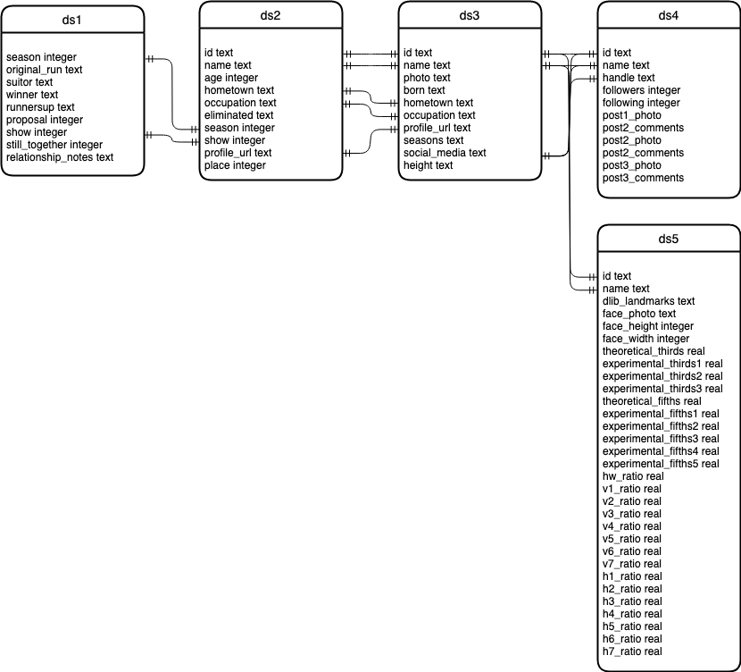

# The Bachelor/Bachelorette Contestant Feature Analysis


DSCI-510 Final Project

Compare the features and place (the number of episodes the contestant was on the show for) of past contestants of ABC's The Bachelor and The Bachelorette.

## TLDR

Build the docker container:
```
docker build . --tag bach
```

Collect all data sets from remote sources:
```
docker run --volume $(pwd):/home/ bach collect.py
```

Collect all data sets from local sources:
```
docker run --volume $(pwd):/home/ bach collect.py --source local
```

Transform/preprocess data for data set 5 and perform evaluations with all algorithms:
```
docker run --volume $(pwd):/home/ bach transform.py
```

## Data sets:

1. General data about the shows
   1. Data about The Bachelor
   2. Data about The Bachelorette shows
2. General data about the shows' seasons
   1. Data about The Bachelor seasons
   2. Data about The Bachelorette seasons
3. Data about The Bachelor and The Bachelorette contestants
4. Instagram data from contestants
5. Granular contestant data compiled from "transformed" data from the other data sets, including measured physical features and quantified "overall attractiveness" from known algorithms

## Data Models and Data Storage

### Data Class

The data is modeled as JSON data. The models for each data set (including subsets) are as follows:

Data sets 1.1 and 1.2:
```
{
  'season': 0, # -1 for null
  'original_run': '', # '' for null
  'suitor': '', # '' for null
  'winner': '', # '' for null
  'runnersup': '', # '' for null
  'proposal': 0, # 0 for no, 1 for yes, -1 for null
  'show': 0, # 0 for Bachelor, 1 for Bachelorette, -1 for null
  'still_together': 0, # 0 for no, 1 for yes, -1 for null
  'relationship_notes':'' # '' for null
}
```

Data sets 2.1 and 2.2:
```
{
  'name': '', # '' for null
  'age': 0, # -1 for null
  'hometown': '', # '' for null
  'occupation': '', # '' for null
  'eliminated': '', # '' for null
  'season': 0, # -1 for null
  'show': 0, # 0 for Bachelor, 1 for Bachelorette, -1 for null
  'profile_url': '',
  'place': 0 # -1 for null
}
```

Data set 3:
```
{
  'name': '', # '' for null
  'photo': '', # '' for null
  'born': '', # '' for null
  'hometown': '', # '' for null
  'occupation': '', # '' for null
  'seasons': '', # '' for null
  'social_media': '', # '' for null
  'height': '' # '' for null
}
```

Data set 4:
```
{
  TBD
}
```

Data set 5:
```
{
  'name': '', # '' for null
  'dlib_landmarks': '', # '' for null
  'face_photo': '', # '' for null
  'face_height': 0, # 0 for null
  'face_width': 0, # 0 for null
  'theoretical_thirds': 0.0, # 0.0 for null
  'experimental_thirds1': 0.0, # 0.0 for null
  'experimental_thirds2': 0.0, # 0.0 for null
  'experimental_thirds3': 0.0, # 0.0 for null
  'theoretical_fifths': 0.0, # 0.0 for null
  'experimental_fifths1': 0.0, # 0.0 for null
  'experimental_fifths2': 0.0, # 0.0 for null
  'experimental_fifths3': 0.0, # 0.0 for null
  'experimental_fifths4': 0.0, # 0.0 for null
  'experimental_fifths5': 0.0, # 0.0 for null
  'hw_ratio': 0.0, # 0.0 for null
  'v1_ratio': 0.0, # 0.0 for null
  'v2_ratio': 0.0, # 0.0 for null
  'v3_ratio': 0.0, # 0.0 for null
  'v4_ratio': 0.0, # 0.0 for null
  'v5_ratio': 0.0, # 0.0 for null
  'v6_ratio': 0.0, # 0.0 for null
  'v7_ratio': 0.0, # 0.0 for null
  'h1_ratio': 0.0, # 0.0 for null
  'h2_ratio': 0.0, # 0.0 for null
  'h3_ratio': 0.0, # 0.0 for null
  'h4_ratio': 0.0, # 0.0 for null
  'h5_ratio': 0.0, # 0.0 for null
  'h6_ratio': 0.0, # 0.0 for null
  'h7_ratio': 0.0 # 0.0 for null
}
```

#### Methods

get_sql_table_values(ds): Take-in an integer data set number and output a list of lists of associated database table values and their SQL types.
```
>>> d = data.bachdata()
>>> d.get_sql_table_values(5)
[['name', 'text'], ['photo', 'text'], ['born', 'text'], ['hometown', 'text'], ['occupation', 'text'], ['seasons', 'text'], ['social_media', 'text'], ['height', 'text']]
```

model_one(ds, data): Take-in an integer data set number and a single raw json (dict) object and return a single json (dict) object modeled for the specified data set

model_many(ds, datas): Take-in an integer data set number and a list of raw json (dict) objects and return a list of json (dict) objects all modeled for the specific data set

### DB Class

Data is stored in a SQL database. The structure of this database, as defined by the data model, is as follows:



## Collection

Collect data sets, facilitate the modeling of raw data, and facilitate the insertion of modeled data into data storage (SQL database).

### How to Run

Build the docker container:
```
docker build collection/ --tag bach
```

#### Arguments:

* set: Optional. Default: [1,2,3]. An integer associated with the desired data set to be collected. This can be a list of integers.
* source: Optional. Default: "remote". The location from where to collect the data for the data set(s) -- local or remote. (local files must be named raw{ds}.json where ds is the number associated with the data set, i.e. raw2.json)
* season: Optional. Default: all seasons (via data sets 1.1 and 1.2). An integer or list of integers associated with a desired season to collect data on. Only applicable with data set 2.
* contestant: Optional. Default: all contestants (via data sets 2.1 and 2.2). A case insensitive string or list of case insensitive strings associated with the first and last name separated by a "_" of a contestant from any season of The Bachelor or Bachelorette or the URL of a contestant's profile page on the [Bachelor Nation Fandom Wiki](https://bachelor-nation.fandom.com). Only applicable with data set 3.
* nowrite: Optional. Default: False. Do NOT overwrite any previously saved information from data set 5 in the database (do not dump and create a new table). Applicable with preprocess flag.

#### Examples:

Collect all available data for all data sets from remote sources and overwrite any old data from these data sets (drop and create new ds1, ds2, and ds3 tables) in the database:
```
docker run --volume $(pwd):/home/ bach collect.py
```

Collect data from The Bachelor/Bachelorette season 14 and overwrite any old data from these data sets (drop and create new ds2 table) in the database:
```
docker run --volume $(pwd):/home/ bach collect.py --dataset 2 --season 14
```

Collect data about The Bachelorette contestant Dale Moss and The Bachelor contestant Cassie Randolph and do NOT overwrite any old data from data set 3:
```
docker run --volume $(pwd):/home/ bach collect.py --dataset 3 --contestant dale_moss "https://bachelor-nation.fandom.com/wiki/Cassie_Randolph" --nowrite
```

Collect data from all contestants from all seasons of The Bachelor/Bachelorette, source the data from a local location (./local/raw2.json), and overwrite any old data from these data sets (drop and create new ds2 table) in the database::
```
docker run --volume $(pwd):/home/ bach collect.py --dataset 2 --source local
```

Collect all available data for data sets 1 and 2 and overwrite any old data from these data sets (drop and create new ds1 and ds2 tables) in the database:
```
docker run --volume $(pwd):/home/ bach collect.py --dataset 1 2
```

Collect all available data for data sets 1 and 2, collection available data from The Bachelor/Bachelorette seasons 8, 9, and 10, collect available data about contestants Naomi Crespo and Derek Peth, source the data from remote locations, and overwrite any old data in the pertinent database tables (drop and create new ds1, ds2, and ds3 tables):
```
docker run --volume $(pwd):/home/ bach collect.py --dataset 1 2 3 --season 8 9 10 --contestant naomi_crespo derek_peth --source remote
```

## Transformation

Create a fifth data by applying transformation methods to data from the other data sets. This fifth data set will contain more granular data of each candidate and will be the data set primarily referenced during analysis.

### Transformations

process_face(b64photo)

get_face_rotation(img)

eval_rule_of_thirds(b64face)

eval_rule_of_fifths(b64face)

eval_golden_ratio(b64face)

### How to Run

Build the docker container:
```
docker build collection/ --tag bach
```

#### Arguments:

* preprocess: Optional. Default: True. Pre-process the data for data set 5.
* nowrite: Optional. Default: False. Do NOT overwrite any previously saved information from data set 5 in the database (do not dump and create a new table). Applicable with preprocess flag.
* evaluate: Optional. Default: True. Evaluate data set 5 with all given algorithmm.
* algorithm: Optional. Default: ['thirds', 'fifths', 'golden']. A string name of an algorithm to evaluate data set 5 with.
* contestant: Optional. Default: all contestants (via data sets 2.1 and 2.2). A case insensitive string or list of case insensitive strings associated with the first and last name separated by a "_" of a contestant from any season of The Bachelor or Bachelorette.

#### Examples:

Create data set 5 by transforming/preprocessing data from the other data sets, overwrite any old data from these data sets (drop and create a new ds5 table) in the database, and perform all algorithms on all records in data set 5:
```
docker run --volume $(pwd):/home/ bach transform.py
```

Create data set 5 by transforming/preprocessing data from the other data sets and overwrite any old data from these data sets (drop and create a new ds5 table) in the database:
```
docker run --volume $(pwd):/home/ bach transform.py --preprocess
```

Transform/preprocess data from the other data sets for The Bachelorette contestant Jason Tartick and do NOT overwrite any old data from these data sets in the database:
```
docker run --volume $(pwd):/home/ bach transform.py --preprocess --nowrite --contestant jason_tartick
```

Perform rule of thirds and golden ratio analysis on all pre-processed contestant records in data set 5:
```
docker run --volume $(pwd):/home/ bach transform.py --evaluate --algorithm thirds golden
```

## Analysis

To-do

## Tasks

### Project Outline and Data Set Identification

- [x] Create Github repo
- [x] Identify data sets
  - [x] Info of all Bachelor seasons: https://en.wikipedia.org/wiki/The_Bachelor_(American_TV_series)
  - [x] Info of all Bachelorette seasons: https://en.wikipedia.org/wiki/The_Bachelorette
  - [x] Info and place of all Bachelor contestants: https://en.wikipedia.org/wiki/The_Bachelor_(season_1) (enumerate seasons)
  - [x] Info and place of all Bachelorette contestants: https://en.wikipedia.org/wiki/The_Bachelorette_(season_1) (enumerate seasons)
  - [x] Info of all Bachelor/Bachelorette cast members: https://bachelor-nation.fandom.com/wiki/Alex_Michel (enumerate names)
  - [x] Popularity and additional photos of cast members: https://instagram.com
  - [x] "Transformed" data from other data sets
- [x] Project outline

### Collect Data

- [x] Build scrapers
  - [x] Wikipedia scraper
    - [x] Data sets 1.1 and 1.2
    - [x] Rename '#' column
  - [x] Bachelor Nation scraper
    - [x] Data sets 2.1, 2.2, and 3
  - [ ] Instagram scraper
    - [ ] Data set(s) 4(.?)
- [x] Multiprocess
- [x] Options
  - [x] Source
  - [x] Seasons
  - [x] Contestants
  - [x] Overwrite
  - [x] Evaluate
  - [x] Preprocess
- [x] Dockerize
- [ ] Collect all the datas!
- [ ] "Transform" the data into a fifth data set
  - [x] Pre-process contestant photos (face images and dlib landmarks)
  - [x] Rule of thirds evaluation
  - [x] Rule of fifths evaluation
  - [x] Golden ratio evaluation

### Model and Store Data

- [x] Model data
  - [x] Create data models for data sets
  - [x] Data class that takes-in raw json data, models it according to the data set, and outputs a structured data set
    - [x] Data sets 1.1 and 1.2 (Wikipedia)
      - [x] Rename '#' column to 'Season'
      - [x] Add 'show' column
    - [x] Data sets 2.1 and 2.2 (Bachelor Nation)
      - [x] Add 'profile_url' column
      - [x] Add 'show' column
      - [x] Add 'season' column
    - [x] Data set 3 (Bachelor Nation)
    - [ ] Data set 4 (Instagram)
    - [x] Data set 5 (Evaluated)
    - [ ] Write data set data from database to an output file
- [x] Data storage (SQL database)
  - [x] DB class that interacts with SQL database
    - [x] Create tables with input list of column tuples
    - [x] Take in pre-modeled json data (formatted by data class) and input it into given data source table
    - [x] Retrieve data from database (account for columns and filters)
    - [x] Retrieve max of data in column from database (account for filters)

### Analysis and Conclusions

- [ ] Output data to file
- [ ] Analyze data and draw conclusions
  - [ ] How should I handle missing data?
